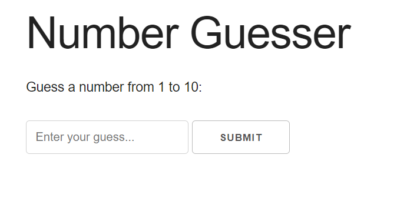
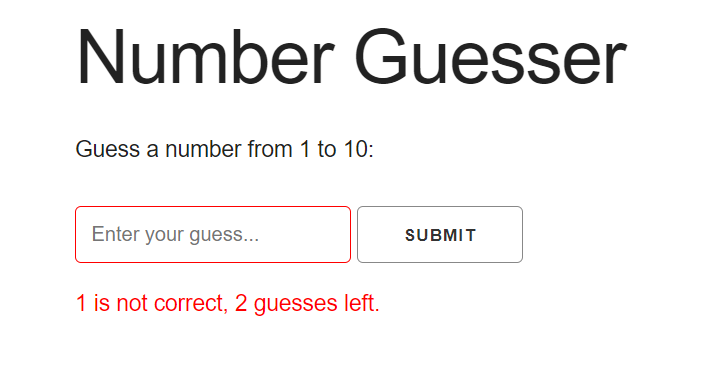
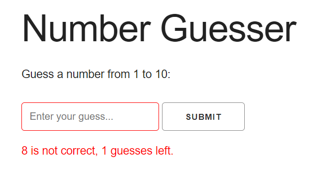
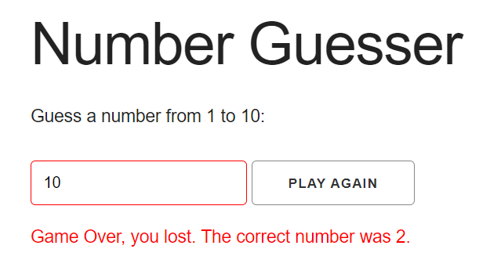
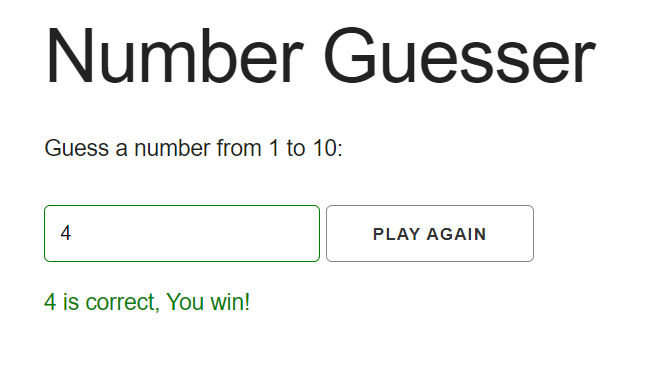

# Number Guessing Game
In this game, the player must guess a random number between 1 - 10 inclusive, within 3 tries to win.

### Screenshots:

<p float="left">
  
  
   
</p>
<p float="left">
  
  
</p>


## Features
* Informs the player of the number of guesses left.
* Informs the player of the correct number when the game is lost.
* Text input box border color changes to red on a wrong answer, and changes to green on a correct answer.
* Lets the player chose to play again.

## Built with
* HTML
* Skeleton CSS
* JavaScript
### JS Concepts utilized:
1. DOM Selectors
2. Event listeners & Event handlers
3. Mouse & keyboard input events
4. Event Delegation
5. Reloading the page with ```window.location.reload()```
6. Generating a random number within a range with ```Math.floor(Math.random() * (max - min + 1) + min)```
7. Manipulating DOM Elements
   1. Setting the value of class attribute of a specified UI element with ```ELEMENT.className ='NEW_CLASS_NAME'```.
   2. Setting the value attribute of a specified UI element with ```ELEMENT.value = 'NEW VALUE'```
   3. Updating the text content in the Element with ```ELEMENT.textContent = 'NEW CONTENT'```


## See this project
This application is hosted on GitHub pages: https://helen-tan.github.io/number-guesser/

Similarly, you may clone this project by running this command from your terminal:

```
git clone https://helen-tan.github.io/number-guesser/
```

This will create a directory in the name of the project folder.

Once you have the project files, open index.html in your browser.